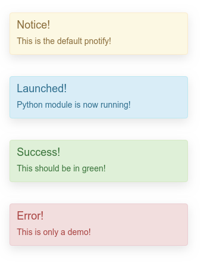

Brython Demo
============

Bython is a mechanism that facilitates the use of Python(3) "in" the browser (instead of or in addition to Javascript).
In real-life, it actually translates the Python into Javascript on-the-fly, that that's not something to worry about
initially.

It would seem to be something maybe useful to experienced Python programmers who don't need too much by the way
of interactive debugging (some run-time errors can be a little terse) but it would appear to be pretty powerful.

To try this out, simply run;

.. code-block:: shell

    pipenv install
    ./server.py

Then point your browser at;

.. code-block:: shell

    http://localhost:8080/index.html

With any luch you should see 'Hello World' in the main window, 'Hello from Python' in the devtools JS console, and
four PNotify boxes floating in the top right of the screen.

The stuff the Python coder needs to worry about is in main.py and notifications.py, everything else is pretty much
static framework and support libraries.